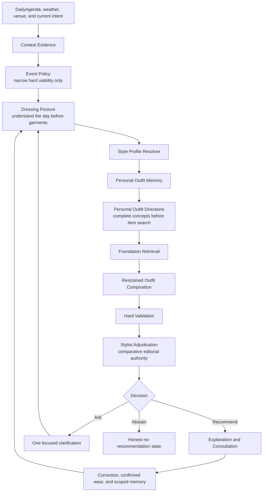
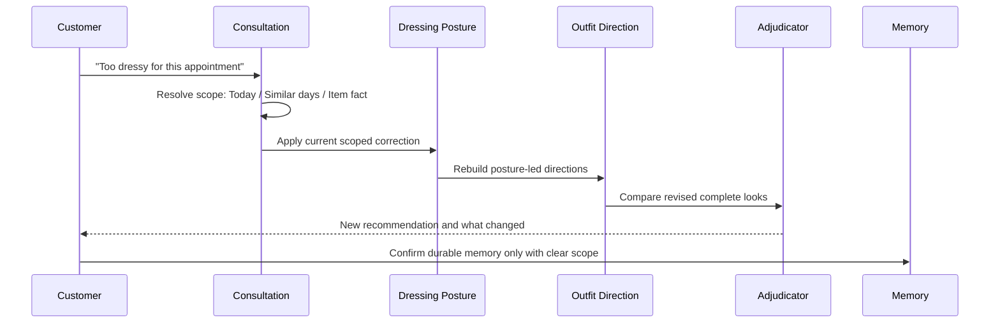
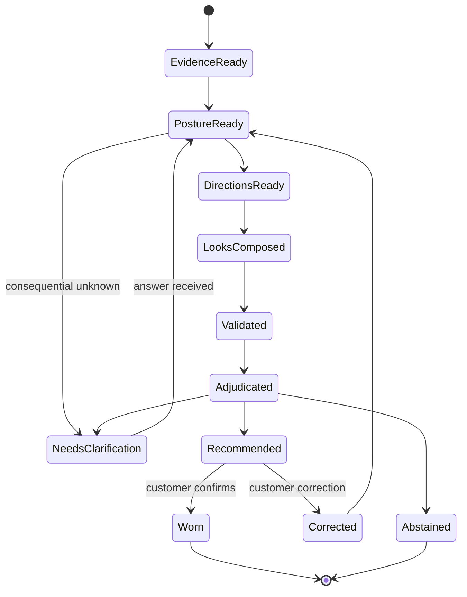

# Curated Recommendation Architecture V2

**Status:** Approved with Product conditions incorporated on July 29, 2026  
**Authority:** This document and `RECOMMENDATION_QUALITY_ROADMAP.md` are the governing technical and product authorities for recommendation behavior.  
**Deployment status:** Implementation authorized in independently testable phases; Production deployment is not authorized.  
**Purpose:** Replace eligible-inventory optimization with a daily styling consultation organized around Dressing Posture, Personal Outfit Memory and Composition, and Stylist Adjudication.

## 0. Authority, environment, and development continuity

This is the universal recommendation architecture for Curated. Founder scenarios are evaluation fixtures, never Founder-specific production rules. The ordinary Production account remains on the exact customer experience and receives no Founder-specific recommendation treatment.

During implementation:

- Production remains unchanged until Product explicitly authorizes each rollout stage.
- The current Founder Preview remains usable. An incomplete V2 phase must not replace or destabilize it.
- V2 is carried inside the one main Curated application and main customer-facing URL. There is no permanent Founder application or browser-selectable engine mode.
- A verified authenticated account may be assigned to V2 only by a server-side rollout decision keyed by its immutable customer ID. Email, host, query parameters, cookies written by the browser, and client payloads are not recommendation-engine authority.
- The Founder account may be activated only after the applicable V2 data, isolation, suppression, quality, and rollback gates pass. Every unassigned customer remains on the currently authorized engine.
- Dormant V2 code in the main application is not activation. Activation requires an independent server code gate, Product-authorization gate, account assignment, global kill switch, and per-account kill switch to permit V2 for that request.
- The temporary separate Founder Preview remains available only for continuity until main-application routing and rollback are verified, then is deliberately retired rather than maintained as a product fork.
- Both modes may read the same customer wardrobe and Profile only through backward-compatible, governed repositories.
- V2 writes cannot corrupt, silently reinterpret, or make unreadable data required by Current Preview.
- Corrections and suppressions are not shared across engines until their compatibility projection, scope semantics, provenance, and rollback behavior pass Phase 1.
- Recommendation caches are isolated by customer, architecture, engine version, contract versions, correction-state version, and feature-flag mode.
- Every recommendation artifact records the architecture and engine that produced it.
- Every cache key and mutable V2 artifact is partitioned by immutable customer ID, architecture version, engine version, feature-flag revision, and applicable correction and suppression revisions.
- A per-account kill switch returns only that customer's recommendation requests to legacy without mutating Wardrobe, Profile, Archive, Calendar, History, or other canonical data.
- Failure or disablement of V2 cannot prevent ordinary Wardrobe, Profile, Calendar, Travel, or Dress My Day use.
- Founder diagnostics are observational. They cannot alter a recommendation unless the same governed capability is available to every customer.
- Current Preview is temporary development continuity, not a permanent product fork. It may be retired only after Founder approval, broader-customer evaluation, the authorized rollout sequence, and the rollback window.

No behavioral implementation may begin against an unresolved contract conflict. Purely editorial cross-references do not require renewed Product approval; a material change to authority, customer memory, recommendation philosophy, or a release gate does.

## 1. Architectural decision

Curated will no longer begin by searching the wardrobe for individually compatible garments and will no longer allow an aggregate score to choose the recommendation.

The recommendation unit is a complete, personally plausible outfit concept for a human day.

The new sequence is:



Scores remain diagnostic evidence. They do not select the winner.

## 2. Governing invariants

1. No garment retrieval occurs before a Dressing Posture exists.
2. Event Policy owns only confirmed hard viability.
3. Dressing Posture owns the human interpretation of effort, ease, movement, thermal reality, social stakes, and formality bounds.
4. Personal Outfit Directions begin with a complete concept or known foundation, not an item pool.
5. Composition adds only pieces that solve a practical or editorial need.
6. Unknown evidence is not equivalent to false.
7. Hard Validation may reject factual impossibility; it does not choose among valid looks.
8. Stylist Adjudication compares complete looks and is the final recommendation authority.
9. Aggregate score cannot independently select or rescue a recommendation.
10. Correction is part of the consultation and must preserve context.
11. Durable learning requires explicit scope and user permission.
12. Every contract is user-scoped, versioned, explainable, and diagnostic without storing hidden chain-of-thought.

### Governed taxonomy registry

The versioned schema registry owns the decision vocabulary. Contracts reference taxonomy values rather than inventing request-specific strings.

At minimum it governs:

- formality: `very-casual`, `casual`, `polished-casual`, `professional`, `dressy`, `formal`, `ceremonial`;
- ceremony: `none`, `restrained`, `expressive`, `formal`;
- effort and physical demand: `low`, `moderate`, `high`;
- confidence: `low`, `medium`, `high`;
- foundation: `dress`, `jumpsuit`, `top-bottom`, `coordinated-set`;
- outfit and support roles;
- movement, footwear, comfort, accessibility, coverage, carrying, silhouette, proportion, material family, garment genre, color relationship, contextual reservation, uncertainty consequence, and reason codes.

Taxonomy additions are backward-compatible and versioned. Renames or semantic changes require migration rules. Unknown or customer-defined concepts remain explicit unresolved evidence until normalized; they cannot bypass the registry.

## 3. Prerequisite contract — Customer Dressing Brief

### Responsibility

Answer:

> What has this customer asked Curated to honor for this request, in their own words and in governed terms?

```ts
type CustomerDressingBrief = {
  schemaVersion: "customer-dressing-brief.v1";
  taxonomyVersion: "recommendation-taxonomy.v1";
  requestId: string;
  ownerUserId: string;
  generatedAt: string;

  originalLanguage: EvidenceReference[];
  normalizedIntent: NormalizedIntent;
  desiredImpression: GovernedPreference[];
  requiredQualities: GovernedRequirement[];
  avoidedQualities: GovernedProhibition[];
  comfortRequirements: ComfortRequirement[];
  accessibilityRequirements: AccessibilityRequirement[];
  coverageRequirements: CoveragePredicate[];
  footwearRequirements: FootwearRequirement[];
  carryingNeeds: CarryingNeed[];
  explicitItemInstructions: ExplicitItemInstruction[];

  activeCorrections: ScopedCorrectionReference[];
  activeSuppressions: SuppressionReference[];
  consequentialUnknowns: ConsequentialUnknown[];
  manageableAssumptions: ManageableAssumption[];

  confidence: ConfidenceLevel;
  evidenceRefs: EvidenceReference[];
};
```

The Brief owns customer meaning, not garment selection. Exact source language remains available for confirmation and audit. Explicit current instructions cannot be silently weakened by Profile defaults, behavior, Founder findings, inference, or editorial judgment.

## 4. Contract 1 — Dressing Posture

### Responsibility

Answer:

> What kind of dressing experience does this day call for before Curated looks at the wardrobe?

### Inputs

- normalized target `DailyAgendaItem` and relevant transitions;
- explicit current notes and desired feeling;
- narrow Event Policy result;
- event-time weather and forecast confidence;
- indoor/outdoor, duration, sitting, standing, walking, carrying, examination, security, and change opportunities;
- explicit comfort, accessibility, and body-respectful requirements;
- context-scoped explicit Style Profile preferences;
- high-confidence occasion habits;
- evidence sufficiency and consequential unknowns.

### Versioned output

```ts
type DressingPosture = {
  schemaVersion: "dressing-posture.v2";
  taxonomyVersion: "recommendation-taxonomy.v1";
  requestId: string;
  ownerUserId: string;
  generatedAt: string;

  dayCharacter:
    | "routine"
    | "professional"
    | "social"
    | "active"
    | "travel"
    | "ceremonial"
    | "intimate"
    | "transitional"
    | "mixed";
  socialStakes:
    | "private"
    | "ordinary-public"
    | "professionally-visible"
    | "socially-visible"
    | "ceremonial";

  formalityRange: {
    floor: FormalityBand;
    preferredFloor: FormalityBand;
    preferredCeiling: FormalityBand;
    ceiling: FormalityBand;
  };
  ceremonyAllowance: "none" | "restrained" | "expressive" | "formal";
  effortBudget: "low" | "moderate" | "high";

  movementPosture: MovementPosture;
  thermalPosture: ThermalPosture;
  weatherProtection: WeatherProtectionPosture;
  carryingPosture: CarryingPosture;
  adjustmentTolerance: "low" | "moderate" | "high";

  preferredFoundationDirections: FoundationDirection[];
  overdoneGenres: OutfitGenre[];
  requiredSupportRoles: SupportRole[];
  optionalSupportRoles: SupportRole[];
  simplicityPreference: "strong" | "moderate" | "neutral";

  criticalUnknowns: ConsequentialUnknown[];
  confidence: ConfidenceLevel;
  evidenceRefs: EvidenceReference[];
  reasonCodes: DressingPostureReasonCode[];
};
```

Runtime validation must enforce:

```text
floor <= preferredFloor <= preferredCeiling <= ceiling
```

An invalid range is a contract error, not an invitation to reorder values silently.

### Decision behavior

- Formality always has a floor and ceiling.
- Weather and movement shape foundation directions before retrieval.
- `polished` is interpreted within the day rather than as universal upward formality pressure.
- Routine days default to proportionate effort unless the customer explicitly asks for more.
- A neutral Style Profile produces a humane context default and lower personal confidence.
- Consequential unknowns produce conditional behavior or one question; they do not silently become prohibitions.

### Boundary

Dressing Posture cannot:

- select garment IDs;
- mutate the Style Profile;
- create venue rules;
- relax Event Policy;
- permanently learn from one request.

## 5. Contract 2 — Personal Outfit Memory and Composition

### Responsibility

Answer:

> Given this Dressing Posture, what would this customer plausibly reach for, and how should Curated complete it with restraint?

### Personal Outfit Memory

Personal Outfit Memory is a user-owned evidence service, not a permanent style label. It stores or derives:

- complete outfits confirmed as worn;
- explicit approval, rejection, and correction outcomes;
- repeated foundations;
- reliable complete-look relationships;
- context-specific garment roles;
- customer substitutions and removals;
- fit and comfort outcomes;
- explicit reservations such as “for dinner” or “only for errands”;
- customer-confirmed evolution;
- exposure history so Curated does not learn only from its own recommendations.

It distinguishes:

- recommended vs. worn;
- worn vs. enjoyed;
- owned vs. chosen;
- inspired vs. practical;
- one-time instruction vs. durable explicit preference;
- explicit evidence vs. inferred behavior.

### Versioned memory snapshot

```ts
type PersonalOutfitMemorySnapshot = {
  schemaVersion: "personal-outfit-memory.v1";
  ownerUserId: string;
  profileVersion: string | null;
  asOf: string;
  knownOutfits: KnownOutfitMemory[];
  knownFoundations: KnownFoundationMemory[];
  combinationRelations: OutfitRelation[];
  occasionRoles: OccasionGarmentRole[];
  substitutions: SubstitutionMemory[];
  contextualReservations: ContextualReservation[];
  comfortOutcomes: ComfortOutcome[];
  correctionEvidence: ScopedCorrectionEvidence[];
  confidence: ConfidenceLevel;
  evidenceRefs: EvidenceReference[];
};
```

### Personal Outfit Direction

A direction is a complete strategy that precedes garment selection.

```ts
type PersonalOutfitDirection = {
  schemaVersion: "personal-outfit-direction.v1";
  taxonomyVersion: "recommendation-taxonomy.v1";
  id: string;
  requestId: string;
  ownerUserId: string;
  postureVersion: DressingPosture["schemaVersion"];
  stylingBriefVersion: PersonalStylingBrief["schemaVersion"];
  memoryVersion: PersonalOutfitMemorySnapshot["schemaVersion"];

  intent: "practical" | "characteristic" | "expressive";
  foundationConcept: FoundationConcept;
  silhouetteIntent: SilhouetteIntent;
  proportionIntent: ProportionIntent;
  paletteIntent: PaletteIntent;
  materialIntent: MaterialIntent;
  formalityBand: FormalityBand;
  effortBurden: EffortBurden;

  requiredCompletionRoles: SupportRole[];
  optionalCompletionRoles: SupportRole[];
  omittedRoles: Array<{ role: SupportRole; reasonCode: string }>;
  contextualReservations: ContextualReservation[];
  personalPlausibilityReasons: string[];

  evidenceRefs: EvidenceReference[];
  uncertainty: ConsequentialUnknown[];
  confidence: ConfidenceLevel;
};
```

### Composition sequence


The engine may produce:

- one excellent direction;
- a primary and one materially different challenger;
- one focused question when a consequential unknown changes viability;
- no direction when a responsible concept cannot be formed.

It must not force three weak alternatives.

### Retrieval behavior

Garment retrieval is constrained by a direction. It does not search the whole eligible wardrobe and ask scoring to discover a concept.

Retrieval priority:

1. confirmed complete combinations appropriate to this posture;
2. confirmed foundations with suitable known completions;
3. characteristic combinations inferred with high confidence;
4. restrained new combinations that fit explicit style and wardrobe evidence;
5. conventional wardrobe-grounded cold-start foundations.

### Unknown evidence behavior

- Confirmed incompatibility may veto.
- Unknown central facts lower confidence.
- Low-consequence unknowns may remain conditional.
- One focused question is asked only when its answer changes the winner or viability.
- An equally strong option with confirmed evidence is preferred without interrogation.
- Unknown garment genre or material is never automatically a prohibition.
- Fragrance is optional editorial finishing only. It is never required for outfit structure, formality, completeness, or recommendation confidence.

### Governed predicates

Decision-critical predicates cannot carry an unrestricted `value: string`. They use operator-specific discriminated unions:

```ts
type CoveragePredicate =
  | { field: "shoulderCoverage"; operator: "is"; value: "required" | "preferred" | "not-required" }
  | { field: "neckline"; operator: "at-most"; value: "high" | "moderate" | "open" }
  | { field: "hemLength"; operator: "at-least"; value: "upper-thigh" | "knee" | "midi" | "ankle" }
  | { field: "opacity"; operator: "is"; value: "opaque" | "lined" | "sheer-with-required-layer" }
  | { field: "fitExposure"; operator: "is"; value: "close" | "balanced" | "relaxed" };
```

The schema registry owns allowed field/operator/value combinations. Similar governed unions cover formality, ceremony, footwear, carrying, movement, material, garment genre, and contextual reservations.

Customer-defined language is handled as follows:

1. retain the exact customer statement as immutable source evidence;
2. normalize it into governed predicates with confidence and provenance;
3. validate the predicate combination against the registry;
4. display a plain-language confirmation of what Curated understood;
5. let the customer correct both interpretation and scope;
6. if normalization is unsuccessful, preserve it as an unresolved consequential or manageable unknown;
7. never turn failed normalization into a hidden prohibition or durable preference.

## 6. Contract 3 — Stylist Adjudication

### Responsibility

Answer:

> Knowing this person, this day, and these complete looks, which would an experienced personal stylist most confidently recommend?

### Inputs

- the unchanged Dressing Posture;
- the unchanged Personal Styling Brief;
- the Personal Outfit Memory snapshot;
- Personal Outfit Directions;
- complete validated looks;
- narrow Event Policy validation;
- evidence sufficiency and unknowns;
- current correction state;
- diagnostics such as cohesion, polish, burden, and confidence;
- at least one challenger when one exists.

### Versioned output

```ts
type StylistAdjudicationDecision = {
  schemaVersion: "stylist-adjudication.v1";
  taxonomyVersion: "recommendation-taxonomy.v1";
  requestId: string;
  ownerUserId: string;
  adjudicatorVersion: string;

  outcome: "recommend" | "revise" | "ask" | "abstain";
  selectedLookId: string | null;
  challengerLookId: string | null;

  realityDecision: AdjudicationCheck;
  personalPlausibilityDecision: AdjudicationCheck;
  effortDecision: AdjudicationCheck;
  coherenceDecision: AdjudicationCheck;
  restraintDecision: AdjudicationCheck;
  counterfactualDecision: AdjudicationCheck;
  uncertaintyDecision: AdjudicationCheck;

  decisiveReasonCodes: string[];
  removedBurden: RemovedBurden[];
  focusedQuestion: FocusedQuestion | null;
  confidence: ConfidenceLevel;
  explanationFacts: EvidenceReference[];
};
```

### Adjudication order

1. Reality — does the complete look make sense for the lived day?
2. Personal plausibility — would this customer credibly choose it?
3. Effort — is physical, maintenance, carrying, and ceremonial effort proportionate?
4. Coherence — does the complete look tell one intentional story?
5. Restraint — can anything be removed without losing value?
6. Counterfactual — is a simpler or more characteristic valid look better?
7. Uncertainty — proceed, condition, ask, or abstain.
8. Decision — recommend, revise, ask, or abstain.

### AI boundary

AI may perform bounded comparative adjudication over already assembled and validated looks. It may not:

- add garments;
- alter normalized roles or garment facts;
- relax Event Policy;
- fabricate personal history;
- mutate the Style Profile;
- choose through an unobservable aggregate score;
- emit hidden chain-of-thought.

It returns a structured decision with bounded reason codes and evidence references.

### Scoring boundary

Cohesion, personal polish, confidence, and burden scores are diagnostics. They may:

- identify areas for comparison;
- support calibration;
- appear in the Recommendation Inspector;
- trigger a challenger review.

They may not:

- independently choose the primary;
- rescue a failed adjudication check;
- turn missing evidence into a positive claim;
- override explicit current instructions.

## 7. Consultation, correction, and suppression authority

Correction is a loop through the same architecture, not a detached chat feature.



Every correction record declares:

- immediate effect;
- customer-facing scope: `today`, `similar-contexts`, or `until-restored`;
- whether it changes canonical garment evidence;
- whether Curated will remember it;
- persistence result;
- provenance and time.

Failed persistence must never appear remembered.

### Authority separation

| Record | Who may create it | Can change a customer recommendation? |
| --- | --- | --- |
| Customer correction | The authenticated customer | Yes, within its confirmed scope |
| Authorized service correction | A governed customer-facing service acting for that customer | Yes, with the same confirmation and audit contract |
| Canonical garment-fact correction | The customer, or a reviewed evidence process | Yes, as item truth |
| Recommendation suppression | The customer | Yes, until confirmed expiry or restoration |
| Inferred preference candidate | The inference service | Ranking guidance only; never silently overwrites explicit preference |
| Product evaluation finding | Product or Founder evaluation | No; it creates fixtures, defects, or acceptance criteria |
| Automated-test expectation | Engineering evaluation | No; it validates behavior |
| Diagnostic observation | Founder/internal tools | No; observational only |

Founder or Product authority cannot mutate a customer’s Style Profile, corrections, suppressions, or recommendation history.

### Scope matcher

`similar-contexts` is stored as a versioned, governed `ContextScopeMatcher`, never a vague label. It contains required, optional, and excluded predicates drawn from the schema registry and a customer-readable description. Curated shows that description before durable persistence.

If the matcher cannot be normalized safely, Curated offers `today` or asks one focused scope question. It never silently broadens the correction.

An active suppression is resolved before Personal Outfit Direction generation and enforced across primary recommendations, alternatives, regeneration, cache reads, consultation responses, and explanations. `until-restored` remains reviewable and reversible; it never deletes the garment.

## 8. Existing architecture disposition

### Retain

- `ContextEvidence` and provenance-bearing values;
- owner-scoped garment evidence contracts;
- evidence sufficiency and confidence;
- Style Profile Resolver and versioned Personal Styling Brief;
- Wardrobe Evidence Summary;
- recommendation diagnostics and founder inspector;
- Outfit Knowledge Graph foundation;
- availability, laundry, rotation, and confirmed-wear records;
- narrow factual Event Policy rules;
- complete-outfit typed structures;
- hard structural validation;
- venue evidence with source, time, and confidence;
- user-scoped authentication and RLS.

### Narrow or refactor

- Event Policy: retain only confirmed viability, safety, availability, venue rules, and explicit prohibitions.
- Context constraints: split confirmed hard facts from Dressing Posture interpretations.
- Wardrobe Evidence: expose combination and occasion behavior to Personal Outfit Memory.
- Cohesion and polish: retain as diagnostic factor evidence consumed by adjudication.
- recommendation follow-up: route through the correction contract and full posture/direction rebuild.

### Retire as recommendation authority

- full-pool eligible-item enumeration;
- `bestSupport` item-by-item support selection;
- the global `WEIGHTS` aggregate as winner selection;
- `assessment.score` sorting as primary selection;
- target-formality arithmetic without a ceiling;
- broad scenario regexes as a substitute for Dressing Posture;
- unknown-as-false hard rejection;
- forced three-option generation;
- explanations generated before adjudication;
- page-specific correction behavior.

## 9. Request state machine



Each transition is idempotent by request and consultation version. A retry must not duplicate memory, recommendation history, or corrections.

## 10. Versioning and observability

Each recommendation record must include:

- context-evidence version;
- Event Policy version;
- Dressing Posture version;
- Style Profile and Styling Brief versions;
- Personal Outfit Memory snapshot version;
- Personal Outfit Direction versions;
- composition version;
- hard-validation version;
- adjudicator version;
- correction-state version;
- engine and feature-flag versions;
- taxonomy and schema-registry versions.

Diagnostics must expose:

- the posture before garments;
- direction concepts before item IDs;
- item retrieval reasons;
- omitted optional roles;
- all hard validation outcomes;
- primary/challenger comparison;
- decisive adjudication reasons;
- uncertainty treatment;
- explanation-safe evidence.

Diagnostics must not expose another customer’s data, secrets, provider credentials, hidden chain-of-thought, or unrestricted private text.

All persisted and cached artifacts are partitioned by authenticated `ownerUserId`. Server authorization and database policies verify ownership independently of browser input. Cross-user cache keys, shared inference state, and Founder-derived defaults are prohibited.

## 11. Broader customer-quality validation

Founder approval is necessary and not sufficient for Production rollout.

Before rollout expands beyond a small authorized cohort, V2 must be evaluated across multiple user-scoped profiles, wardrobe compositions, histories, comfort and accessibility requirements, style expressions, and cold-start states.

The evaluation must prove:

- the engine does not overfit the Founder wardrobe or Founder meaning of polish;
- “conservative,” “comfortable,” “expressive,” “casual,” and similar concepts remain customer-specific;
- identical events and wardrobes can produce meaningfully different directions when explicit customer profiles differ;
- incomplete profiles receive restrained neutral behavior and never inherit Founder assumptions;
- no protected or sensitive characteristic is used as a style shortcut;
- thresholds hold across the approved evaluation population, not only Founder fixtures;
- all customer corrections, suppressions, history, evidence, caches, and artifacts remain isolated;
- low-confidence inference cannot become a hard exclusion;
- alternatives independently pass the entire brief and are materially distinct;
- fewer options are returned when fewer excellent options survive.

Founder scenarios remain zero-tolerance regression fixtures but are not scenario branches or the sole quality definition.

### Zero-tolerance rollout gates

Any occurrence stops rollout:

- active suppression is ignored;
- cross-customer evidence or preference contamination;
- an explicit current instruction is silently violated;
- a hard safety, availability, ownership, or confirmed venue rule is violated;
- an explanation asserts unsupported evidence;
- a stale cached result survives a correction-state or engine-version change;
- a correction is described as remembered when persistence failed;
- a formality or ceremony ceiling is exceeded;
- an outfit foundation is structurally incomplete or contradictory;
- Founder diagnostics alter the customer recommendation result.

## 12. Document disposition

| Document | V2 disposition |
| --- | --- |
| `RECOMMENDATION_QUALITY_ROADMAP.md` | Governing product direction |
| `RECOMMENDATION_ARCHITECTURE_V2.md` | Governing technical and contract authority |
| `RECOMMENDATION_IMPLEMENTATION_PLAN_V2.md` | Governing phased delivery plan, subordinate to the two authorities above |
| `RECOMMENDATION_IMPLEMENTATION_PLAN.md` | Historical and superseded |
| `AI_STYLIST_ENGINE.md` | Retained principles; aggregate scoring is diagnostic-only where it conflicts with V2 |
| `STYLE_PROFILE_INTEGRATION.md` | Retained evidence model; token-affinity and style vetoes not authorized by V2 are superseded |
| `DRESS_MY_DAY_V1_PRD.md` | Retained customer workflow and presentation; forced alternatives and conflicting recommendation authority are superseded |
| `DRESS_MY_DAY_VISUAL_INTERACTION_SPEC.md` | Retained presentation authority unless it conflicts with honest uncertainty or V2 outcomes |
| `CALENDAR_INTEGRATION.md` | Retained DailyAgenda provider boundary |
| `BRAND_BIBLE.md` | Governing brand and service acceptance criteria |

## 13. Privacy and brand alignment

This architecture strengthens Curated as a private style house:

- **Discernment:** one credible recommendation may replace three weak options.
- **Recognition without surveillance:** personal memory is user-owned, scoped, reviewable, and permissioned.
- **Romance grounded in reality:** the day and body-respectful practical needs precede garments.
- **Stewardship:** known combinations and owned wardrobe precede novelty or shopping.
- **Confidence without authority theater:** unknowns lower confidence, prompt one question, or produce abstention.
- **Hospitality:** correction is immediate, scoped, transparent, and reversible.
- **Maximalist with restraint:** evidence may be rich, while the final recommendation remains edited.

No feature in this architecture requires new collection of measurements, photographs, contacts, email, or unrelated personal data.
